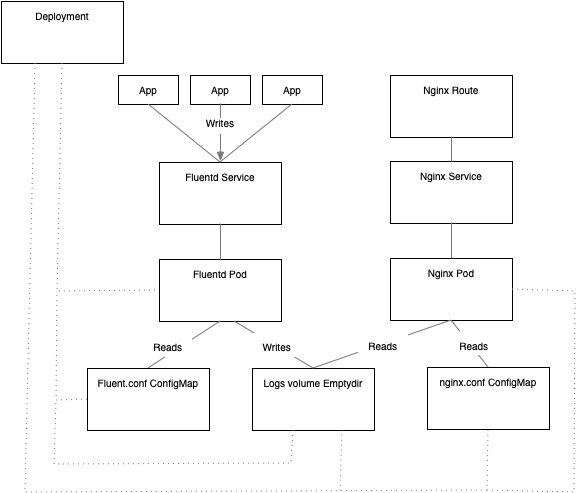

## OCP Fluentd ## 

Experiment with Fluentd fowarding capabilities by sending your application logs to a Fluentd http endpoint. Fluentd will write those logs to an `emptydir` volume via an output plugin. An nginx container defines a `volumeMount` on the `emptydir` and exposes the logs that Fluentd writes via a `route`. 

The deployment is namespace specific, requires no special permissions  and is a fun way to experiment with Fluentd input/output plugins, filters and parsers. 

The fluent.conf file is mounted  via the fluentd-config `ConfigMap` and the nginx.conf file is made available via the nginx-config `ConfigMap` 

In this example we also expose Fluentd's http endpoint via a route so that we may post messages to it via the command line. However your applications should be able to get to Fluentd's http endpoint directly via a `service` and this will keep your traffic local to the cluster. 


To get started apply the resources to the cluster: 

```
oc create -k . 
```
Export some variables to make the excercise more convenient:

```
export FLUENT_HOST=$(oc get route fluentd-logger --template='{{ .spec.host }}')
export NGINX_HOST=$(oc get route nginx-logger --template='{{ .spec.host }}')
export TODAY=$(date '+%d-%m-%Y') 
```

Create some POST requests to the logger. Note that in the fluent.conf file, we are only interested in the values contained in the nested message key. 

``` 
curl -X POST -d \
    json='{"key":"value","message":"{\"user\":1,\"num\":2}","user":1,"num":2}'  \
    http://${FLUENT_HOST}/app.log
```

View the logs through nginx: 

``` 
curl -X GET http://${NGINX_HOST}/app-${TODAY}.log
```

Architecture: 




